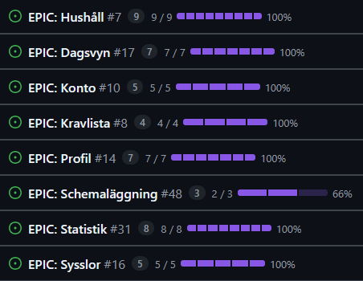

# Inlämning 2

Caroline Fagner<br>
Martin Börjesson<br>
Krister Karhu<br>
Patrik Lax<br>
Therese Lindberg

# Hushållet

Applikationen låter dig och dina hushållsmedlemmar skapa och fördela sysslor som ska göras i hemmet.<br>
Via statistikvyn kan ni följa fördelningen och rättvist ta er an nya sysslor!

## Installation

1. Klona projektet
   ```bash
   git clone https://github.com/The-greatest-team-in-the-world/household
   ```
2. Installera beroenden
   ```bash
   npm install
   ```
3. Starta Expo-appen
   ```bash
   npm start
   ```
4. Logga in med
   ```bash
   user: dev@dev.dev
   pass: devdevdev
   ```
5. Skapa hushåll, alternativt gå med i hushåll med kod
   ```bash
   TEAM25
   ```
6. Följ instruktioner på skärmen

## Krav

39 av 40 punkter från kravlistan uppfyllda.



### Krav för godkänt:

1. [x] De nödvändiga kraven ifrån kravlistan ovan är uppfyllda
2. [x] Applikationen kommunicerar data till och från en backend tjänst (ni väljer).
3. [x] Git & GitHub har använts.
4. [x] Projektmappen innehåller en README.md fil
5. [x] Uppgiften lämnas in i tid!
6. [x] Muntlig presentation är genomförd

### Krav för väl godkänt:

7. [x] Alla punkter för godkänt är uppfyllda
8. [x] Ni har använt CI<del>/CD</del> under projektet.
